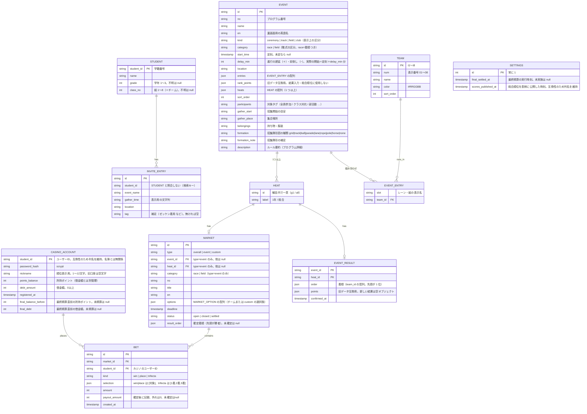

# データモデル

表画面は2026-10-02以降、表示時のDBアクセスを行わない。`FestivalSnapshot`（`src/lib/festival/snapshot.ts`）にチーム・種目・競技結果・個人別招集案内・人数・公開設定・公開済み総合順位・最終精算後の個人順位だけを保存し、ビルド時に `snapshot.data.ts` を生成する。生徒氏名と口座ハッシュは含めず、未公開の総合順位・精算前の個人順位は空配列にする。個人別案内を含むため生成物をGit非追跡とし、サーバー側のqueriesだけから参照する。表示用のプログラム状態もビルド時に固定し、運営変更は再デプロイ後に反映する。DBのスキーマは変更しない。

トップの人数表示はRepositoryの `countStudents()` を使用する。メモリ実装は配列の件数、Supabase実装はHEADリクエスト（`Prefer: count=exact`、`Range: 0-0`）のContent-Rangeを読む。人数表示のために名簿全行を転送しない。

> 実体: TypeScript の型は `src/lib/festival/types.ts`（表側）と `src/lib/casino/types.ts`（カジノ）、Supabase のテーブル定義は `supabase/schema.sql`。永続化は `src/lib/db/repository.ts` のインターフェース越しに行い、Supabase 未設定時は `src/lib/db/memory.ts`（メモリ＋`.data/db.json`）で動く。

## 補足

| エンティティ | 説明 |
|---|---|
| Student | 学籍番号がID。表側の招集案内検索と `/me` の氏名表示に使う。認証に使わず、カジノ口座とも結び付けない |
| CasinoAccount | 任意のユーザーID・パスワード（scrypt ハッシュ）・必須ニックネームを保持。ポイントと借金は別々に管理する。入場APIの入力は `userId`、署名付き Cookie の主体もユーザーID。互換性のためドメインの `studentId` とDB列 `student_id` は維持するが、値はカジノのユーザーIDで名簿照合はしない。既存口座とベットはそのまま使える。最終精算時に精算前の値を `final_balance_before` / `final_debt` に保存する |
| Team / Event / EventEntry | 8 チーム（＝組）と種目。`entries` が組み合わせ（レーン→チーム）、`rank_points` は旧データ互換用で計算に使わない。`kind` は表示上の区分、`category` は賭式の区分 |
| Heat | 種目の中で独立に着順が決まる単位。リレー類は学年別（1年/2年/3年）、それ以外は「総合」1 つ。結果・Market はヒート単位 |
| EventResult | ヒートの全組順位。全登録チームを1回ずつ `order` に並べて保存する。得点は入力・計算せず、新しい `points` は `{}`。確定と同時に対応するMarketをsettledにする。既に精算した同じ順位の再送では旧points・配当を保持する |
| InviteEntry | 実行委員がCSVでアップロードする招集案内データ。学籍番号一致で検索表示（認証なし。誰の番号でも検索できる） |
| Settings | 最終精算の実行時刻（null なら未精算。借入・返済が可能、`/ranking` は非公開）と、総合順位の公開時刻（nullなら表側に順位を出さない） |

### 出場競技表（DB の外にある静的データ）
「誰がどの競技の何人目か」は実行時のDB検索を使わず、CSVからビルド時に生成するJSモジュールとして配る（速度優先。機能4b）。ローカルCSVがないクラウドビルドは、サーバー専用キーで非公開Supabase StorageからCSVを取得する。

| 項目 | 内容 |
|---|---|
| 元データ | `data/学籍番号別出場競技.csv`。見出しは `学籍番号,出場競技` の 2 列固定。1 セルに複数競技が入り、区切りは**全角縦棒 `｜`**（U+FF5C。ASCII の `|` ではない） |
| クラウド用原本 | 非公開Storageの `festival-private/entries/2026.csv`。`npm run entries:upload` で保存し、差し替え前の原本は `entries/archive/<SHA256>.csv` に退避。匿名取得を拒否する。バケット・オブジェクト名は環境変数で変更可能 |
| 1 件の形 | `競技名（枠）`。例: `大縄跳び 前半（16人目）`・`男女混合リレー7~8走（第1走者）`。`（）` が無ければ枠は空文字として扱う |
| 生成物 | `src/lib/festival/entries.data.ts`（自動生成・編集禁止）。`ENTRY_LABELS`（出場枠の辞書）＋ `STUDENT_ENTRIES`（学籍番号 → 辞書の添字）＋ `ENTRY_DATA_VERSION`（生成元 CSV の SHA-256 先頭 8 桁） |
| 生成 | `npm run entries`（`scripts/generate-entries.mjs`）。`npm run dev` / `npm run build` の前に自動実行。不正な CSV は生成時に失敗させる |
| 参照 | `src/lib/festival/entries.ts` の `findStudentEntries()`。見つからない学籍番号は `null`（0 件と区別する） |
| 大きさ | 提供された最終版は946人・出場枠195種。辞書化してバンドルに同梱する。利用者の画面からStorageへ問い合わせない |

> 学籍番号は 4 桁で **学年1桁・組1桁・出席番号2桁**（`2334` = 2年3組34番）。`studentIdParts()` で読み、名簿（STUDENT）が無くても `/me` の黒帯に学年・組を出す。名簿にある場合のチーム名・氏名は DB 由来なので後から Suspense で加わる。

### 3D集合案内（DB外）

`src/lib/ground-guide/navigation.ts` の `GuidePlan` は `assembly`（集合）・`destination`（競技位置）・補足・招集タイミングを持つ。座標は `Point { x, z }` の模式座標で、実測メートルではない。競技・学年・組・走順・試合から演技台帳の配置を求める。`AssemblyGroup` は識別子・対象ラベル・補足と模式座標の範囲（幅・奥行き）を持つ。`assemblyGroups()` の全体区分と `personalGroupId()` の個人区分を両画面で共有する。`classSeat()` は追加配置図の学年・組から外周円弧上の生徒席を求め、初期出発地点に使う。経路はトラック横断可の直接線。3D面・頂点・素材は `model.ts` で生成しglTFにも出力する。

GPS・較正・モデル保存のUIは2026-10-01に除去。座標変換とglTF生成の純粋関数は既存の自動検証用に保持する。詳細は [ground-guide/README.md](ground-guide/README.md)。

`festival-day.ts` は確認済み開催日と台帳の固定時刻。`ledger.ts` の `AgendaItem` は競技キー・競技名・出場枠・集合タイミング/場所・開始予定・持ち物・補足・全員参加区分・順序を持つ。`personalAgenda()` が出場表、全員参加、対象学年の全員競技、個人招集CSVを統合する。個人CSVの値を優先し、空欄は台帳から補う。時計時刻を所要時間から推測せず、開始見込みは既存のサーバー計算結果を使う。DBスキーマは変更しない。

### 進行の遅延・前倒し
- 種目の `start_time` は定刻で固定し、実際の開始見込みは `start_time + delay_min 分` で求める（`src/lib/festival/schedule.ts`）
- 種目の「+1分」はその種目**以降の全種目**の `delay_min` を +1、「全体 +1分」は全種目を +1、「定刻に戻す」は全て 0
- 種目に紐づく Market の締切も `deadline + delay_min 分` を実際の締切として扱う（ベット受付の判定もこの値）

### 同時更新の扱い
登録・ベット・取消・借入返済・配当と利子・最終精算は `Repository.commitCasinoMutation()` で期待値の照合と全変更を一度に保存する。競合なら何も保存せず、読み直して最大3回試す。保存例外でも全変更を戻す。ベットの締切、Market・種目の遅延、口座、対象ベット、最終精算日時を照合する。配当と最終精算は口座の追加・Marketの追加も検出する。

Supabaseは `supabase/casino-atomic.sql` のサーバー専用RPCを使う。残高・借金・賭け金・配当の列はbigint。アプリ側は安全な整数の範囲を検証する。`casino_receipts(request_key, created_at)` は成功したベット・借入返済の再送識別子を記録し、同じ口座・操作・識別子の再送を二重処理しない。RLSとRPCの実行権限によりクライアントから直接変更できない。

全Market確定前の最終精算は拒否する。精算後は新規口座・ベット・取消・借入返済を停止する。確定済みの競技結果は同じ値の再送だけを許し、変更は拒否する。当日設定とSQL適用は [casino-operations.md](casino-operations.md)。

### 認証の系統（3つは互いに独立）

| 系統 | 対象 | 方式 |
|---|---|---|
| 表側 | `/login` → `/me` | 認証なし。学籍番号は検索キーで、セッションもパスワードも持たない |
| カジノ | `/casino/enter` → `/casino` 配下・`/api/casino/*` | ユーザーID＋パスワード（`CASINO_ACCOUNT.password_hash`）。登録時はニックネーム必須。署名付き Cookie セッション |
| 実行委員 | `/admin/login` → `/admin` | Supabase Auth（メール＋パスワード） |
| Market | ベットの対象（全体優勝 / 種目ごと / custom の二択）。締切(`deadline`)を過ぎると `closed`、実行委員が結果確定すると `settled`。対象は TEAM（8チーム）、custom のみ MARKET_OPTION |
| Bet | 1人が1つのMarketに複数回賭けることも許可（同じ対象への追加賭けも、別対象・別賭式への分散賭けも可）。`selection` は TEAM.id または MARKET_OPTION.id |

### 賭式（`BET.kind`）

| Market | 賭式 |
|---|---|
| `type=event` かつ `category=race` かつタイトルがリレー | 単勝 `win`・複勝 `place`・三連単 `trifecta` |
| 非リレーの `type=event` / `category=field` / `type=overall` | 単勝のみ |
| `type=custom` | 単勝のみ（二択） |

## ポイント・オッズ計算ロジック

実装は `src/lib/casino/odds.ts`、テストは `payout.test.ts`。単勝・複勝は賭式ごとの独立プールを使い、**的中時は最低5倍**。三連単は全組み合わせ**50倍固定**で、参加人数・賭け金プール・旧DBの個別倍率に左右されない。プールで不足する払戻ポイントはシステムが補填する（サイト内専用ポイント）。

| 賭式 | 見込み倍率（締切前・随時更新） | 配当（結果確定時） |
|---|---|---|
| 単勝 | `max(5, 単勝プール合計 ÷ 対象への単勝賭け金)` | 1着への的中ベットに `floor(賭け金 × max(5, プール合計 ÷ 的中対象の賭け金))` |
| 複勝 | `max(5, 複勝プール合計 ÷ 3 ÷ 対象への複勝賭け金)` | 3着以内の対象のうち賭けがある対象でプールを等分し、対象ごとの倍率を最低5倍にして `floor(賭け金 × 倍率)` |
| 三連単 | 50.00倍 | 1〜3着の着順まで一致したベットに `賭け金 × 50` |

- **賭けが無い対象**: 単勝・複勝は5.00倍、三連単は50.00倍を表示する。
- **見込み払戻**: `floor(賭け金 × 計算倍率)`。単勝・複勝で5倍を超える倍率は他のベットで変動する。三連単は変動しない。
- **端数**: 倍率表示は小数2桁に切り捨て。配当は各ベットごとに `floor`。
- **外れた場合**: 賭けたポイントは没収（払戻0）。
- **既存DBとの互換性**: `trifectaOddsDefault` / `trifectaOddsOverrides` は保存時の競合照合のため保持する。新しい計算では使わず、表示APIは50と空の個別設定を返す。確定済みの `payoutAmount` は再計算しない。管理画面に倍率変更フォームは設けない。

## ベット・取消の検証（サーバー側）

実装は `src/lib/casino/betting.ts`、テストは `betting.test.ts`。Route Handler から呼び、クライアントの計算値は受け取らない。

- 賭け金は 1 以上の整数のみ（0・マイナス・小数・文字列は拒否）、`points_balance` 以下
- `status=open` かつ `deadline` 前のみ受付。締切後・確定後は新規・追加・取消すべて拒否
- 三連単は 3 対象がすべて異なること。賭式は上表で許可されたもののみ
- 取消は締切前の自分のベットを 1 件単位で、賭け金を全額 `points_balance` に戻す

## 借金（クレジット）・利子ロジック

実装は `src/lib/casino/debt.ts`（借入・返済・利子・最終精算の純粋関数）、`src/lib/casino/settle.ts`（結果確定＝配当＋利子）、テストは `debt.test.ts` / `settle.test.ts`。

- 初期配布ポイント: 全員 `points_balance = 1000`, `debt_amount = 0`
- **借入れ**: 生徒が金額（1回500ptまで）を指定して申請すると、`points_balance += 借入額`、`debt_amount += 借入額`。合計の借入上限は設けない（`debt_amount` は際限なく増加しうる）
- **利子発生タイミング**: いずれかの Market が `settled`（結果発表）になるたび、その時点で `debt_amount > 0` の生徒全員に対し `debt_amount = floor(debt_amount * 1.1)`（複利で増加。`points_balance` には影響しない）
- **返済**: 生徒がいつでも任意の額（`points_balance` 以下かつ `debt_amount` 以下）を指定して返済でき、`points_balance -= 返済額`、`debt_amount -= 返済額`
- **最終精算**: 体育祭終了時、実行委員が `/admin` から実行すると全生徒に対し `points_balance -= debt_amount`（返済しきれずマイナスになってもそのまま）、`debt_amount = 0` に確定し、以降の借入れ・返済を停止する

## 最終順位（ランキング）ロジック

実装は `src/lib/casino/settlement.ts`（`rankAccounts`）、テストは `settlement.test.ts`。

- 最終精算後の `points_balance` をそのまま**純資産**として扱う（`debt_amount` は精算により0のため、実質 `points_balance - debt_amount` と同義）
- `/ranking` では純資産の降順で個人を並べ、あわせて精算前の `final_balance_before`（所持ポイント）と `final_debt`（借金額）も表示する。同点は同順位（1, 1, 3 方式）、同点内はユーザーID順
- 表示名（`displayName` / `name`）は口座の `nickname`。空（ニックネーム導入前の旧口座）ならユーザーIDを表示する。生徒名簿との照合は行わない

## 総合順位（表画面）

実装は `src/lib/festival/standings.ts` の `overallStandings()`。競技得点の合計・勝利数・チーム表示順から順位を計算しない。

- `type=overall`・`status=settled` のMarketの `result_order` に実行委員が並べた全8組を保存する。配当は先頭の組を勝者として計算する。
- 全組が1回ずつある場合だけ1〜8位として表示する。未確定、旧来の勝者だけ、重複・未知IDは `null` とし、下位順位を補わない。
- 表側は `settings.scores_published_at` が非nullのときだけ総合順位を受け取る。総合順位未入力での公開は拒否する。
- 旧DB列 `rank_points` と `points` は保持するが、新規結果の得点は空で入力・計算・表示しない。スキーマ変更は不要。

### 通し再生データと個人情報の分離
`src/lib/ground-guide/playback.ts` の `Actor`（学年・組・走順または部別区分、集合点と戻り先）、`Phase`（説明、短縮再生秒数、全区分の経路）を純粋関数で生成する。`playbackFrame()` は任意時刻を経路長で補間し、区分数と識別子を保持する。DB・名簿・GPSは参照しない。

個人別CSVと `entries.data.ts` はGit非追跡。CSVもSupabase設定もない場合は空の辞書を生成する。Supabase設定済みでローカルCSVがない場合はStorageから取得し、失敗時はビルドを止める。テストでは実在の出場割当を固定せず、存在するCSVとの一致を検証する。ローカルCSVなしの環境では辞書の参照整合性と取得処理を検証する。

総合順位の公開・非公開は `scores_published_at` だけを更新し、同時に完了した最終精算日時を古い値に戻さない。

### 騎馬戦の紅白予想

種目別Marketのoptionsは `red / RED / 紅組` と `white / WHITE / 白組` の2件。event_id・heat_idを維持して進行の締切変更と連動する。結果はEventResult.orderとMarket.resultOrderに紅白2件を保存し、先頭を単勝の勝者にする。pointsは空。旧クラス別のベット・結果がある場合、`supabase/casino-event-rules.sql` は更新せず停止する。
