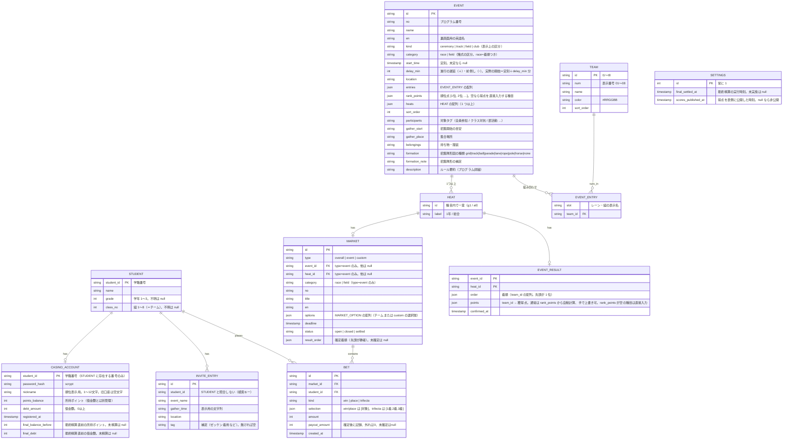

# データモデル

> 実体: TypeScript の型は `src/lib/festival/types.ts`（表側）と `src/lib/casino/types.ts`（カジノ）、Supabase のテーブル定義は `supabase/schema.sql`。永続化は `src/lib/db/repository.ts` のインターフェース越しに行い、Supabase 未設定時は `src/lib/db/memory.ts`（メモリ＋`.data/db.json`）で動く。

## 補足

| エンティティ | 説明 |
|---|---|
| Student | 学籍番号がID。カジノ口座の作成可否（名簿にある番号か）とランキングの氏名表示に使う。**表側では認証に使わない**（表側の学籍番号入力は招集案内の検索キー。`/me` の氏名表示にだけ参照する） |
| CasinoAccount | カジノ入場用のパスワード（scrypt ハッシュ）とポイント残高を保持。`points_balance`（所持ポイント）と `debt_amount`（借金額）は別々に管理する。入場後は署名付き Cookie セッションに `student_id` を持ち、Route Handler はそこから本人を特定する。最終精算時に精算前の値を `final_balance_before` / `final_debt` に保存する（ランキング併記用） |
| Team / Event / EventEntry | 8 チーム（＝組）と種目。`entries` が組み合わせ（レーン→チーム）、`rank_points` が順位点（種目ごと。R8 演技台帳の配点）。`kind` は表示上の区分、`category` は賭式の区分 |
| Heat | 種目の中で独立に着順が決まる単位。リレー類は学年別（1年/2年/3年）、それ以外は「総合」1 つ。結果・Market はヒート単位 |
| EventResult | ヒートの確定結果。実行委員は**着順**を入力し、得点は `rank_points` から自動計算（上書き可）。`rank_points` が空の種目（玉入れ・棒引き）は得点を直接入力し、着順は得点順に導く。得点板は全ヒートの `points` の合計。確定と同時に対応する Market を settled にする |
| InviteEntry | 実行委員がCSVでアップロードする招集案内データ。学籍番号一致で検索表示（認証なし。誰の番号でも検索できる） |
| Settings | 最終精算の実行時刻（null なら未精算。借入・返済が可能、`/ranking` は非公開）と、得点の公開時刻（null なら表側に得点を出さない） |

### 出場競技表（DB の外にある静的データ）
「誰がどの競技の何人目か」は DB に入れず、CSV からビルド時に生成する JS モジュールとして配る（速度優先。機能4b）。

| 項目 | 内容 |
|---|---|
| 元データ | `data/学籍番号別出場競技.csv`。見出しは `学籍番号,出場競技` の 2 列固定。1 セルに複数競技が入り、区切りは**全角縦棒 `｜`**（U+FF5C。ASCII の `|` ではない） |
| 1 件の形 | `競技名（枠）`。例: `大縄跳び 前半（16人目）`・`男女混合リレー7~8走（第1走者）`。`（）` が無ければ枠は空文字として扱う |
| 生成物 | `src/lib/festival/entries.data.ts`（自動生成・編集禁止）。`ENTRY_LABELS`（出場枠の辞書）＋ `STUDENT_ENTRIES`（学籍番号 → 辞書の添字）＋ `ENTRY_DATA_VERSION`（生成元 CSV の SHA-256 先頭 8 桁） |
| 生成 | `npm run entries`（`scripts/generate-entries.mjs`）。`npm run dev` / `npm run build` の前に自動実行。不正な CSV は生成時に失敗させる |
| 参照 | `src/lib/festival/entries.ts` の `findStudentEntries()`。見つからない学籍番号は `null`（0 件と区別する） |
| 大きさ | 909 人・出場枠 195 種で辞書化して約 22KB（gzip 約 5.6KB）。分割やフェッチはせずバンドルに同梱する |

> 学籍番号は 4 桁で **学年1桁・組1桁・出席番号2桁**（`2334` = 2年3組34番）。`studentIdParts()` で読み、名簿（STUDENT）が無くても `/me` の黒帯に学年・組を出す。名簿にある場合のチーム名・氏名は DB 由来なので後から Suspense で加わる。

### 3D集合案内（DB外）

`src/lib/ground-guide/navigation.ts` の `GuidePlan` は `assembly`（集合）・`destination`（競技位置）・補足・招集タイミングを持つ。座標は `Point { x, z }` の模式座標で、実測メートルではない。競技・学年・組・走順・試合から演技台帳の配置を求める。`AssemblyGroup` は識別子・対象ラベル・補足と模式座標の範囲（幅・奥行き）を持つ。`assemblyGroups()` の全体区分と `personalGroupId()` の個人区分を両画面で共有する。`classSeat()` は追加配置図の学年・組から外周円弧上の生徒席を求め、初期出発地点に使う。経路はトラック横断可の直接線。3D面・頂点・素材は `model.ts` で生成しglTFにも出力する。

`Calibration` は本部前と生徒席側の2つの緯度・経度。GPS・較正値は画面内メモリだけで保持し、DB・localStorage・サーバーに保存しない。位置合わせ前は現在地をモデルに投影しない。詳細・原資料の個人情報を除いた要約は [ground-guide/README.md](ground-guide/README.md)。

### 進行の遅延・前倒し
- 種目の `start_time` は定刻で固定し、実際の開始見込みは `start_time + delay_min 分` で求める（`src/lib/festival/schedule.ts`）
- 種目の「+1分」はその種目**以降の全種目**の `delay_min` を +1、「全体 +1分」は全種目を +1、「定刻に戻す」は全て 0
- 種目に紐づく Market の締切も `deadline + delay_min 分` を実際の締切として扱う（ベット受付の判定もこの値）

### 同時更新の扱い
ポイントの増減（ベット・取消・借入・返済）は Route Handler が純粋関数で新しい残高を計算し、`Repository.updateBalances(studentId, expected, next)` で**現在値が期待値と一致するときだけ**書き込む（compare-and-set）。一致しなければ読み直して最大 3 回やり直す。結果確定・利子・最終精算は実行委員だけが行う単発操作なので、複数行の更新をまとめて書く。

### 認証の系統（3つは互いに独立）

| 系統 | 対象 | 方式 |
|---|---|---|
| 表側 | `/login` → `/me` | 認証なし。学籍番号は検索キーで、セッションもパスワードも持たない |
| カジノ | `/casino/enter` → `/casino` 配下・`/api/casino/*` | 学籍番号＋パスワード（`CASINO_ACCOUNT.password_hash`）。署名付き Cookie セッション |
| 実行委員 | `/admin/login` → `/admin` | Supabase Auth（メール＋パスワード） |
| Market | ベットの対象（全体優勝 / 種目ごと / custom の二択）。締切(`deadline`)を過ぎると `closed`、実行委員が結果確定すると `settled`。対象は TEAM（8チーム）、custom のみ MARKET_OPTION |
| Bet | 1人が1つのMarketに複数回賭けることも許可（同じ対象への追加賭けも、別対象・別賭式への分散賭けも可）。`selection` は TEAM.id または MARKET_OPTION.id |

### 賭式（`BET.kind`）

| Market | 賭式 |
|---|---|
| `type=event` かつ `category=race`（着順が付く競技） | 単勝 `win`・複勝 `place`・三連単 `trifecta` |
| `type=event` かつ `category=field` / `type=overall` | 単勝のみ |
| `type=custom` | 単勝のみ（二択） |

## ポイント・オッズ計算ロジック

実装は `src/lib/casino/odds.ts`、テストは `payout.test.ts`。単勝・複勝は**賭式ごとに独立したプール**を持ち、控除率は 0%。三連単は全ての異なる3チームの着順に既定倍率 336.00 倍を適用し、実行委員が締切前に組み合わせ別の倍率を上書きできる。三連単の払戻には締切時点の保存倍率を使う。ベット時点では倍率は確定しない。

| 賭式 | 見込み倍率（締切前・随時更新） | 配当（結果確定時） |
|---|---|---|
| 単勝 | `単勝プール合計 ÷ その対象への単勝賭け金` | 1着の対象に賭けた人でプール全額を賭け金比で按分 |
| 複勝 | `複勝プール合計 ÷ 3 ÷ その対象への複勝賭け金` | 3着以内の対象のうち**賭けがある対象の数**でプールを等分し、各対象に賭けた人で按分 |
| 三連単 | 組み合わせ別の設定倍率。未設定なら全組み合わせの既定倍率 | 1〜3着の着順まで一致したベットに `floor(賭け金 × 締切時点の設定倍率)` |

- **賭けが無い対象**: 単勝・複勝は倍率を計算せず `―` と表示する。三連単は賭けが無くても設定倍率を表示する
- **見込み払戻**: `floor(賭け金 × 表示倍率)`。単勝・複勝は他の生徒のベット、三連単は実行委員の締切前の変更で変動する
- **端数**: 倍率表示は小数2桁に切り捨て。配当は各ベットごとに `floor`
- **外れた場合**: 賭けたポイントはそのまま没収（0が返る）。単勝・複勝で的中ベットが1件も無い場合はプールも没収

## ベット・取消の検証（サーバー側）

実装は `src/lib/casino/betting.ts`、テストは `betting.test.ts`。Route Handler から呼び、クライアントの計算値は受け取らない。

- 賭け金は 1 以上の整数のみ（0・マイナス・小数・文字列は拒否）、`points_balance` 以下
- `status=open` かつ `deadline` 前のみ受付。締切後・確定後は新規・追加・取消すべて拒否
- 三連単は 3 対象がすべて異なること。賭式は上表で許可されたもののみ
- 取消は締切前の自分のベットを 1 件単位で、賭け金を全額 `points_balance` に戻す

## 借金（クレジット）・利子ロジック

実装は `src/lib/casino/debt.ts`（借入・返済・利子・最終精算の純粋関数）、`src/lib/casino/settle.ts`（結果確定＝配当＋利子）、テストは `debt.test.ts` / `settle.test.ts`。

- 初期配布ポイント: 全員 `points_balance = 1000`, `debt_amount = 0`
- **借入れ**: 生徒が金額（1回500ptまで）を指定して申請すると、`points_balance += 借入額`、`debt_amount += 借入額`。合計の借入上限は設けない（`debt_amount` は際限なく増加しうる）
- **利子発生タイミング**: いずれかの Market が `settled`（結果発表）になるたび、その時点で `debt_amount > 0` の生徒全員に対し `debt_amount = floor(debt_amount * 1.1)`（複利で増加。`points_balance` には影響しない）
- **返済**: 生徒がいつでも任意の額（`points_balance` 以下かつ `debt_amount` 以下）を指定して返済でき、`points_balance -= 返済額`、`debt_amount -= 返済額`
- **最終精算**: 体育祭終了時、実行委員が `/admin` から実行すると全生徒に対し `points_balance -= debt_amount`（返済しきれずマイナスになってもそのまま）、`debt_amount = 0` に確定し、以降の借入れ・返済を停止する

## 最終順位（ランキング）ロジック

実装は `src/lib/casino/settlement.ts`（`rankAccounts`）、テストは `settlement.test.ts`。

- 最終精算後の `points_balance` をそのまま**純資産**として扱う（`debt_amount` は精算により0のため、実質 `points_balance - debt_amount` と同義）
- `/ranking` では純資産の降順で個人を並べ、あわせて精算前の `final_balance_before`（所持ポイント）と `final_debt`（借金額）も表示する。同点は同順位（1, 1, 3 方式）、同点内は学籍番号順
- 表示名（`displayName`）は口座の `nickname`。空（ニックネーム導入前の旧口座）なら名簿の氏名、名簿にも無い学籍番号は学籍番号をそのまま出す。名簿の氏名（`name`）は行に持つが、`/ranking`・F4 RANK には表示しない

## 得点板（表画面）ロジック

実装は `src/lib/festival/standings.ts`、テストは `standings.test.ts`。

- ヒートごとの獲得点は `EVENT_RESULT.points`（着順→`rank_points`。足りない順位は 0 点）
- 得点板はチームごとの合計点（全種目・全ヒート）の降順。同点は同順位で、並びは 1 位回数（ヒート単位）の多い順→`sort_order`
- 表側には `settings.scores_published_at` が null でない場合だけ表示する

### 通し再生データと個人情報の分離
`src/lib/ground-guide/playback.ts` の `Actor`（学年・組・走順または部別区分、集合点と戻り先）、`Phase`（説明、短縮再生秒数、全区分の経路）を純粋関数で生成する。`playbackFrame()` は任意時刻を経路長で補間し、区分数と識別子を保持する。DB・名簿・GPSは参照しない。

個人別CSVと `entries.data.ts` はローカル限定。CSVがなければ空の辞書を生成する。テストでは実在の出場割当を固定せず、存在するCSVとの一致を検証する。
