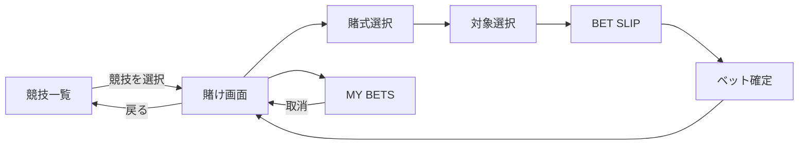

# カジノ 賭け画面 UI仕様

## 1. 概要

競技一覧画面で選択した競技について、オッズの確認・賭式の選択・ベットを行う画面。

本画面では競技一覧を表示しない。
競技の選択・切り替えは1つ前の競技一覧画面で行い、本画面は「現在選択している1競技へのベット」に集中する。

また、本画面は筐体のディスプレイ内部に表示されるWeb UIであり、画面外の物理キー等は想定しない。
すべての操作は画面内のタップ・クリックで完結させる。

---

## 2. デザインコンセプト

一般的なWebアプリのカードUIではなく、

**「電子式の賭け端末・オッズ表示盤」**

として見えるデザインとする。

画面全体を一枚のディスプレイとして扱い、複数の独立したカードを並べるのではなく、

- 罫線
- 数値
- 発光文字
- 選択カーソル
- 表示切り替え
- 数値更新

によって情報階層を表現する。

### 推奨表現

- 暗い背景
- 発光する文字
- LED / CRT風のにじみ
- 微細なスキャンライン
- 若干の低解像度感
- オッズ更新時の短い点滅
- 数値切り替えアニメーション
- 選択中の行の反転・発光
- 細い罫線
- 数字の視認性が高いフォント

### 避ける表現

- 白背景
- SaaS風カードUI
- 過度な角丸
- Material Design的な部品
- 大量の独立カード
- 一般的なWebサイトらしいドロップダウン
- 過剰なグラデーション

演出によって、以下の可読性を損なってはならない。

- 現在の競技
- 締切
- オッズ
- 選択対象
- 賭け金
- 所持ポイント
- 借金

---

# 3. 基本レイアウト

基本構造は以下とする。

```text
┌──────────────────────────────┐
│ STATUS                       │
│ BALANCE / DEBT               │
├──────────────────────────────┤
│ EVENT HEADER                 │
│ 競技名 / 締切                │
├──────────────────────────────┤
│ BET TYPE                     │
│ 単勝 / 複勝 / 三連単         │
├──────────────────────────────┤
│                              │
│                              │
│       BETTING AREA           │
│                              │
│   オッズ盤 / 三連単選択      │
│                              │
│                              │
├──────────────────────────────┤
│ BET SLIP                     │
│ 選択内容 / 金額 / 払戻見込   │
├──────────────────────────────┤
│ MY BETS / BACK               │
└──────────────────────────────┘
```

画面の主役は `BETTING AREA` とする。

---

# 4. STATUS

画面上部に現在の口座情報を常時表示する。

```text
BALANCE      1,240 PT
DEBT           500 PT
```

## 表示項目

- `points_balance`
- `debt_amount`

両者は別々に表示する。

本画面では純資産等への換算は行わない。

---

# 5. EVENT HEADER

競技一覧画面で選択された競技を表示する。

例：

```text
05 / 男女混合リレー

BET CLOSE
00:12:48
```

## 表示項目

- 競技番号
- 競技名
- ベット締切までの残り時間
- Market状態

## Market状態

### 受付中

```text
BET CLOSE
00:12:48
```

残り時間をカウントダウン表示する。

### 締切済み

```text
CLOSED
```

新規ベット・追加ベット・取消を禁止する。

### 結果確定済み

```text
SETTLED
```

結果確認状態とし、新規操作はできない。

---

# 6. 前画面への戻り

競技を変更したい場合は、競技一覧画面へ戻る。

本画面内に、

- Market一覧
- 競技一覧
- 横から展開する競技メニュー

等は設置しない。

戻る操作は画面上部または下部に小さく配置する。

例：

```text
‹ EVENTS
```

または

```text
[ BACK ]
```

競技変更は必ず前画面を経由する。

---

# 7. 賭式選択

現在の競技に複数の賭式が存在する場合、EVENT HEADER直下で切り替える。

`category=race` の場合：

```text
 WIN        PLACE       TRIFECTA
 単勝        複勝         三連単
──────────────────────────────
```

選択中の賭式は、

- 下線
- 文字発光
- 色反転

などによって明確にする。

## 表示条件

| Market | 表示 |
| --- | --- |
| `event_win` | 単勝 |
| `event_place` | 複勝 |
| `event_trifecta` | 三連単 |
| `overall` | 単勝相当 |
| `custom` | 専用二択UI |

`category=field` の競技では原則として単勝のみとなるため、不要な賭式タブは表示しない。

---

# 8. 単勝・複勝

## 8.1 オッズ盤

8チームを独立したカードとして並べるのではなく、一つの表形式のオッズ表示盤として扱う。

```text
 TEAM             ODDS        POOL
─────────────────────────────────
 01               3.24         420
 02               7.18         190
▶03               1.86         731
 04               4.52         301
 05               2.31         589
 06                 ―            0
 07               5.20         261
 08               8.73         156
```

## 各行の情報

- チーム番号
- 必要に応じてチーム名
- 現在の見込み倍率
- そのチームに賭けられているポイント

## 選択

行全体をタップ可能とする。

選択中の行には、

```text
▶
```

のカーソルを表示するか、行全体を反転・発光させる。

例：

```text
▶03               1.86         731
```

---

# 9. 賭けなしの表示

対象チームへのベットが0の場合、倍率は計算しない。

```text
06                  ―            0
```

以下の表現は使用しない。

```text
0.00
∞
N/A
```

表示は `―` を基本とする。

---

# 10. BET SLIP

チームを選択すると画面下部にBet Slipを展開する。

対象未選択時は最小化しておき、BETTING AREAを広く使用する。

## 展開状態

```text
SELECTED
TEAM 03

ODDS
1.86

STAKE
┌────────────────────────────┐
│           100 PT           │
└────────────────────────────┘

[ +10 ] [ +50 ] [ +100 ] [ MAX ]

EST. RETURN
186 PT

┌────────────────────────────┐
│         BET 100 PT         │
└────────────────────────────┘
```

---

# 11. ベット金額入力

1回のベット額は1pt以上の整数とする。

## 入力可能

```text
1
10
100
500
```

## 入力不可

```text
0
-100
10.5
```

また、現在の `points_balance` を超えるベットは禁止する。

## ショートカット

金額直接入力に加え、最低限以下を用意する。

```text
+10
+50
+100
MAX
```

`MAX` は現在の `points_balance` を設定する。

---

# 12. 見込み払戻額

現在の見込み倍率と入力金額から参考となる払戻額を表示する。

```text
EST. RETURN
186 PT
```

これは結果確定時の配当を保証する値ではない。

他ユーザーのベットによってパリミュチュエル方式の倍率が変化するため、

```text
EST.
```

または

```text
見込み
```

であることを明示する。

未確定の入力金額自体は正式なプール計算には含めない。

---

# 13. ベット確定

Bet Slip下部にベット確定操作を配置する。

```text
┌────────────────────────────┐
│         BET 100 PT         │
└────────────────────────────┘
```

ボタンには可能な限り金額を含める。

これにより、

- 選択対象
- 現在倍率
- ベット金額

を確認した上で操作できるようにする。

---

# 14. ベット処理中

二重操作防止のため、リクエスト処理中はBET操作を無効化する。

例：

```text
PROCESSING...
```

処理中にBETボタンを再度押せないようにする。

---

# 15. ベット成功

成功時は短い演出を表示する。

```text
BET ACCEPTED

TEAM 03
100 PT

BALANCE
1,240 → 1,140
```

数秒以内に通常画面へ戻す。

別ページへは遷移しない。

同一Marketでは、

- 同じチームへの追加ベット
- 別チームへの分散ベット

が可能なため、そのまま連続して操作できる状態に戻す。

---

# 16. 三連単

三連単では336通りすべてのオッズ一覧を表示しない。

BETTING AREA自体を三連単専用UIへ切り替える。

```text
TRIFECTA

       1ST          2ND          3RD

     ┌─────┐      ┌─────┐      ┌─────┐
     │ 03  │  →   │ 07  │  →   │ 01  │
     └─────┘      └─────┘      └─────┘


             03 - 07 - 01


EST. ODDS
28.42
```

---

# 17. 三連単のチーム選択

`1ST` / `2ND` / `3RD` の各欄をタップすると、チーム選択UIを表示する。

```text
SELECT 2ND

01        02        03        04

05        06        07        08
```

すでに別順位で使用しているチームは選択できない。

例：

```text
03
SELECTED AS 1ST
```

UI側で選択を禁止するとともに、サーバー側でも重複指定を拒否する。

---

# 18. 三連単の倍率

1〜3着のすべてが指定された場合のみ、その組み合わせの現在倍率を表示する。

```text
03 → 07 → 01

EST. ODDS
28.42
```

他ユーザーが賭けている別の三連単組み合わせは一覧表示しない。

---

# 19. 三連単のBET SLIP

```text
03 → 07 → 01

EST. ODDS
28.42

STAKE
100 PT

EST. RETURN
2,842 PT

┌────────────────────────────┐
│         BET 100 PT         │
└────────────────────────────┘
```

金額入力・確定処理については単勝・複勝と共通の処理を使用する。

---

# 20. Custom Market

`type=custom` の二択Marketでは通常の8チームオッズ盤を使用しない。

2つの選択肢をBETTING AREAの中央に表示する。

例：

```text
GENERAL BATTLE

大将戦


       RED                  WHITE

┌──────────────┐      ┌──────────────┐
│              │      │              │
│     紅組     │  VS  │     白組     │
│              │      │              │
│    ×1.62     │      │    ×2.41     │
│              │      │              │
└──────────────┘      └──────────────┘
```

選択肢をタップすると通常のBet Slipへ接続する。

---

# 21. MY BETS

本画面から現在の競技に対する自分のベットを確認できるようにする。

画面下部に、

```text
MY BETS     3
```

を配置する。

タップすると展開する。

```text
MY BETS

単勝
TEAM 03
100 PT                         [取消]

単勝
TEAM 07
50 PT                          [取消]

三連単
03 → 07 → 01
20 PT                          [取消]
```

原則として、**現在表示している競技・Marketに関係するベットを優先表示する**。

全競技を含む完全なベット履歴は別画面で扱ってよい。

---

# 22. ベット取消

締切前であれば、自分の確定済みベットを1レコード単位で取り消せる。

取消後、そのレコードの賭け金を全額 `points_balance` に戻す。

締切後は取消できない。

```text
LOCKED
```

または取消操作自体を非表示にする。

---

# 23. エラー表示

エラーは画面全体を別ページに遷移させず、その場で表示する。

## 残高不足

```text
INSUFFICIENT BALANCE

BALANCE
80 PT

BET
100 PT
```

必要に応じて借入画面への導線を表示する。

## 締切済み

```text
BETTING CLOSED
```

## 通信失敗

```text
CONNECTION ERROR

[ RETRY ]
```

## 不正入力

```text
INVALID STAKE
```

エラー後も入力内容を可能な限り保持する。

---

# 24. オッズ更新

常時リアルタイム通信は必須としない。

以下の場合に最新オッズへ更新する。

- 画面読み込み時
- 自分のベット確定後
- 自分のベット取消後
- 一定間隔のポーリング
- 必要に応じた手動更新

更新時は画面全体を再読み込みせず、数値のみを更新する。

倍率が変更された場合は短い点滅・数値切替演出を許可する。

---

# 25. 基本画面例

```text
┌──────────────────────────────────┐
│ BALANCE  1,240 PT     DEBT 500  │
├──────────────────────────────────┤
│                                  │
│ 05 / 男女混合リレー              │
│ BET CLOSE               12:48    │
│                                  │
│ WIN        PLACE       TRIFECTA   │
│ ━━━                              │
├──────────────────────────────────┤
│                                  │
│ TEAM              ODDS      POOL │
│ ──────────────────────────────── │
│  01               3.24       420 │
│  02               7.18       190 │
│ ▶03               1.86       731 │
│  04               4.52       301 │
│  05               2.31       589 │
│  06                 ―          0 │
│  07               5.20       261 │
│  08               8.73       156 │
│                                  │
├──────────────────────────────────┤
│ SELECTED / TEAM 03               │
│                                  │
│ ODDS                      1.86    │
│                                  │
│ STAKE                            │
│ ┌──────────────────────────────┐ │
│ │           100 PT             │ │
│ └──────────────────────────────┘ │
│                                  │
│ [ +10 ][ +50 ][ +100 ][ MAX ]   │
│                                  │
│ EST. RETURN              186 PT  │
│                                  │
│ ┌──────────────────────────────┐ │
│ │         BET 100 PT           │ │
│ └──────────────────────────────┘ │
├──────────────────────────────────┤
│ ‹ EVENTS       MY BETS 3         │
└──────────────────────────────────┘
```

---

# 26. 画面遷移



競技の変更は必ず、

`賭け画面 → 競技一覧 → 別競技の賭け画面`

の順で行う。

賭け画面内部で別競技へ直接切り替える機能は持たない。

---

# 27. レスポンシブ

スマートフォン縦画面を基準とする。

情報の順番は常に、

1. STATUS
2. EVENT HEADER
3. BET TYPE
4. BETTING AREA
5. BET SLIP
6. MY BETS / BACK

とする。

PC表示でも基本的な情報構造は変更せず、横幅を過度に広げない。

ディスプレイそのものが中央に存在しているような最大幅を設定する。

---

# 28. 受け入れ条件

- [ ] 前画面で選択した競技名が表示される
- [ ] 本画面には競技一覧・Market一覧を表示しない
- [ ] 前画面へ戻る操作が存在する
- [ ] 残高と借金額が常時確認できる
- [ ] 締切までの時間またはMarket状態が確認できる
- [ ] race競技では単勝・複勝・三連単を切り替えられる
- [ ] 単勝・複勝では8チームのオッズを一覧確認できる
- [ ] 賭けがない対象の倍率は `―` と表示される
- [ ] チームを選択するとBet Slipが展開する
- [ ] 1pt以上の整数だけを賭けられる
- [ ] 残高を超えるベットを確定できない
- [ ] ベット前に対象・金額・見込み払戻額を確認できる
- [ ] ベット成功後に残高が更新される
- [ ] 同じMarketへ続けて追加ベットできる
- [ ] 三連単では1・2・3着を個別指定できる
- [ ] 三連単で同一チームを複数順位に指定できない
- [ ] 三連単では選択中の組み合わせだけ倍率を表示する
- [ ] Custom Marketでは二択専用UIを表示できる
- [ ] 締切前の自分のベットを1件単位で取り消せる
- [ ] 締切後は新規ベット・追加・取消ができない
- [ ] 通信エラー時に入力内容を可能な限り保持して再試行できる
- [ ] スマートフォンから主要操作を問題なく行える
