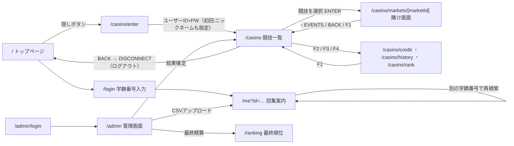

# 画面

トップのロード演出は同じタブの初回だけ約0.9秒（充填0.6秒・100%表示0.1秒・フェード0.15秒）。スキップ可能で、再訪は即表示する。ヒーローの登場演出はロード終了後、カードはスクロールで画面に入ってから再生する。左下の「演出 ON/OFF」はOSの設定を初期値にし、サイト内の選択を保存する。

> GitHub Pages の暫定公開版は `/` のトップページ・プログラム・時刻表のみ。個人検索フォームは無効化し、カジノ／管理画面を含むサーバー必須画面は公開対象外とする。以下は全機能版（Vercel）の画面構成。

| # | 画面 | パス | 概要 | 認証 |
|---|---|---|---|---|
| 1 | トップページ | `/` | ローディング → ヒーロー「滅！」・開催日 → 集合時刻と学籍番号入力 → ABOUT → 爆裂 8 CLASSES（公開前は色だけ、公開後は確定した総合順位（得点なし）） → 爆裂 PROGRAM（12 枚のカード＋詳細モーダル） → TIMETABLE → CTA → フッター（「79」5 連打が隠し入口） | 不要 |
| 2 | 学籍番号入力 | `/login` | 学籍番号だけを入力して `/me?id=…` へ。認証ではなく検索キーの入力 | 不要 |
| 3 | マイページ | `/me?id=<学籍番号>` | 学籍番号・所属 → 開催日と朝の時刻 → 自分の当日案内（プログラム順。集合タイミング・場所・出場枠・開始予定・持ち物を統合） → 「ほかの人の案内を確認する」（初期閉。番号検索・競技一覧）。カードで集合場所/競技の流れを切替 | 不要 |
| 4 | カジノ入場 | `/casino/enter` | 隠しボタン経由で到達。NEW ACCOUNT で好きなユーザーID（半角英数字・ハイフン・アンダースコア4〜32文字）＋パスワード＋ニックネーム（順位表示用・1〜12文字）を設定。LOGIN でユーザーID＋パスワードを入力。名簿照合は不要 | 不要（ここで認証） |
| 5 | カジノ画面（競技一覧） | `/casino` | 全体優勝／種目別／custom の Market を端末リスト形式で一覧。次に締め切られる Market を強調 | カジノ入場後 |
| 5a | 賭け画面 | `/casino/markets/[marketId]` | 1 Market へのベットに集中。残高・借金、締切、賭式（単勝・複勝・三連単）、オッズ盤／三連単選択／二択、Bet Slip、MY BETS（取消）。確定済み Market を自分のベット付きで開くと結果演出（リール→着順→HIT/MISS） | カジノ入場後 |
| 5b | クレジット（F2） | `/casino/credit` | 所持・借金・純資産の表示、借入（1回500まで）、返済。最終精算後は操作不可 | カジノ入場後 |
| 5c | 履歴（F3） | `/casino/history` | 自分のベットを Market ごとに一覧（PENDING / HIT / MISS）と賭け金・払戻・収支の合計 | カジノ入場後 |
| 5d | ランク（F4） | `/casino/rank` | 精算前は自分の暫定純資産と暫定順位のみ、精算後は全体の順位表（NAME 列はニックネーム） | カジノ入場後 |
| 6 | 実行委員ログイン | `/admin/login` | 実行委員用ログイン（メール＋パスワード） | 不要 |
| 6a | 実行委員パスワード設定 | `/admin/setup` | Supabase の招待・再設定メールから開き、本人が新しいパスワードを登録 | 招待・再設定リンク |
| 7 | 実行委員管理画面 | `/admin?tab=…` | 初期表示は結果入力。種目・学年を選択し、1〜8組をドラッグ・↑↓・矢印キーで並べ替え→確認→確定。総合順位・優勝も全8組を並べる。得点入力・自動集計は無し。「順位公開」で確定した総合順位を公開。進行・チーム・種目・Market・CSV・最終精算のタブは維持 | 実行委員ログイン後 |
| 8 | 最終順位ランキング | `/ranking` | 黒帯（FINAL 透かし）。精算前は「LOCKED」、精算後は純資産（所持ポイント−借金額）順のランクカード（ニックネーム＋ユーザーID） | 不要（最終精算後のみ公開） |

## 補足
- フッターの「実行委員 管理・結果入力」から `/admin?tab=results` へ。管理画面は結果入力が初期表示で、全8タブはスマホでも折り返す。種目・学年を選択すると全8組の並べ替えフォームが開く。スマホは種目選択を1行のセレクトに収める。全種目のフォームを同時には描画しない。
- トップのプログラム・総合順位はビルド時の固定データから静的配信する。番号検索はクライアント遷移し、3D案内・開発用デモは開いたときだけ読み込む。カジノの時計と締切表示は1秒ごとに更新する。
- クラスの表示名・色は1組 黄色（`#ffe600`）、2組 水色（`#87ceeb`）、3組 白（`#ffffff`）、4組 赤（`#d92b2b`）、5組 橙（`#ec7a1c`）、6組 桃色（`#ff6fb5`）、7組 緑（`#1f9d55`）、8組 青（`#1f6fd0`）を使用する。
- `/ground-guide?id=…&event=…`：DB不要。集合場所/競技の流れを切替し、学籍番号・競技を引き継ぐ。集合の初期出発地は自分の生徒席。走順が不明な場合は選択を求める。回転・ズームは詳細操作、GPS・モデル保存のUIは除去。配置・組み込みは [ground-guide/README.md](ground-guide/README.md)。
- 隠し入口はトップページのフッター「NAGATA 79TH」の「79」。1.4 秒以内に 5 回連続タップで `/casino/enter` の筐体 → 液晶内CLI起動。可視のアイコンや導線は置かない
- `/me` は静的出場表・台帳・ビルド時の招集案内から当日案内を表示する。表示時のDB照会・生徒氏名の取得は行わず、所属は学籍番号から判断する。
- 表側（`/login`・`/me`）とカジノ（`/casino/enter` 以降）の認証は完全に独立している。表側にはセッションが無く、`/me` を見ていてもカジノには入れない。逆にカジノ入場中でも `/me` は学籍番号を入力して見る
- `/casino` 内の単勝・複勝オッズは最低5倍で賭けられるたびに再計算。賭けがない対象も5倍を表示する。三連単は全組み合わせ50倍固定。画面上部とBet Slipに最低・固定倍率のルールを表示し、管理画面は倍率変更フォームを設けずルールを案内する。締切後は「集計中」、結果発表後は当落・配当を表示する
- 賭け画面のオッズは 10 秒ごとのポーリング・自分のベット／取消後・`[R] SYNC` で更新し、変わった数値だけ短く点滅させる（常時接続は使わない）。競技一覧（`/casino`）も 10 秒ごとに再取得し、LCD 右上に `LAST SYNC`・`LIVE`（更新直後は `UPDATE`）・`[R] SYNC` を出す
- 確定済み Market で自分のベットが的中していると、結果演出（リール）が止まった直後に的中演出（HIT）が重なって 3.4 秒出る。閉じると結果演出に戻る
- 賭け画面には競技一覧・Market 一覧を置かない。競技の変更は必ず `/casino` に戻って行う
- 賭式の直下に選択中の的中条件を1文で表示する。単勝は1着、複勝は3着以内、三連単は1〜3着の順番一致。タブ切替で説明を更新し、単勝のみ・二択でも対応する説明を出す。
- 賭け画面の情報の順番（スマホ縦基準・PC でも同じ）: STATUS → EVENT HEADER → 賭式 → BETTING AREA → BET SLIP → MY BETS / ‹ EVENTS
- 裏画面の見た目・操作体系は [DESIGN.underground.md](DESIGN.underground.md)
- カジノ筐体は最大760×820px、枠6px・液晶余白12px。375px幅で選択盤を2列、広い筐体では選択盤と金額入力を2列にし、内部を縦スクロールする。操作は44px以上、入力文字は16px以上を保つ。競技一覧は日本語名を優先する。
- ベット・借入返済は15秒で通信待ちを打ち切る。結果未確認なら同じ注文・識別子で再試行し、連打を防ぐ。古い同期結果で新しい残高を上書きしない。F3履歴・F4ランクも表示中だけ10秒更新する。ログアウト失敗はその場で案内する。
- 管理画面の最終精算は未確定Market数を表示し、残っている間は実行できない。
- 狭い画面では演出ON/OFFの領域を筐体の下に確保し、BACKキーと重ねない。
- 「借りる」「返済」は F2 CREDIT（`/casino/credit`）に置く。所持ポイントは筐体の CREDIT メーターに、借金額は各画面の STATUS 行に常時表示する
- 表画面の自動再取得は行わない。管理者の進行・順位・招集案内変更は再ビルド・再デプロイ後に反映する。カジノ共通一覧はサーバー内で3秒だけ再利用し、書込み時は破棄する。他のインスタンスも3秒で再取得する。
- 表画面のトークン・不変条件は [DESIGN.festival.md](DESIGN.festival.md)

## デザインテーマ（2系統）
- **表画面（`/`・`/login`・`/me`・`/admin`・`/ranking`）**: 「爆裂」テーマ（モック v2）。黒×クリーム地に蛍光ピンク・黄・青、Anton と Shippori Mincho、直角と硬い黒影、巨大な「滅！」とマーキー帯のポスター調
- **裏画面（`/casino/enter`・`/casino`）**: 「古い賭博端末」テーマ。緑単色液晶・茶黒の金属筐体・等幅ログ（DESIGN.underground.md を参照）
- **切り替え演出**: 隠しボタンから筐体を表示し、液晶内にモックv3のCLI起動ログを描く
- 配色コード・フォント名・トークンは [DESIGN.festival.md](DESIGN.festival.md)（表）と [DESIGN.underground.md](DESIGN.underground.md)（裏）に固定済み

### カジノ演出・開発確認（2026-09-12）
- 入場画面はモックv3の19行・配色・文字送り・下端からの積み上げを再現。起動後は接続ログと9段階バーを表示して認証フォームへ進む。スキップ可能、動きを減らす設定では0.5秒の静止表示。
- 起動と的中演出は液晶内に限定し、外側のモニター枠と操作台には重ねない。
- 開発時のみ右下のDEVパネルから通常ログイン、起動・的中デモ、音の確認ができる。デモはDBを更新しない。通常の認証・API認可は維持する。
- SOUNDは初期OFF。ONでオリジナル短調BGMと操作音・的中音を再生し、OFF・タブ非表示・画面離脱で停止する。

### 競技の流れ
リレー系は「走前」と「走後」の区分を会場図に併記する。反時計回りに走り、終了した選手は走後で退場を待つ。集合図は走前への経路を表示する。
カードの「競技の流れを見る」で表示。現在の場面説明→動く会場図→再生/一時停止・前後の場面の順。場面選択・速度・スライダー・区分一覧は初期閉のdetailsへまとめる。集合図との同時表示はしない。初期停止・タブ非表示時停止。演出OFF・OSの動きを減らす設定でも「流れを再生」を押せば再生でき、静止したまま前後の場面を切り替えることもできる。

### 2026-10-02 賭式と騎馬戦

リレーのみ複勝・三連単を表示し、他は単勝のみ。騎馬戦の賭け画面は紅組・白組の2択。管理画面の騎馬戦も紅白2組だけを表示し、勝った組を上に並べて確認・確定する。総合順位は引き続き全8組。

### 検証用の結果リセット

「結果入力」の確定済み競技（総合順位・追加二択を含む）に「動作検証用：この結果をリセット」を表示する。開いて内容を確認・チェックし、選んだ競技の確定だけを取り消す。確定後に対象口座が変わった場合はエラーを表示し停止する。演出ON/OFFボタンは全画面から削除する。
